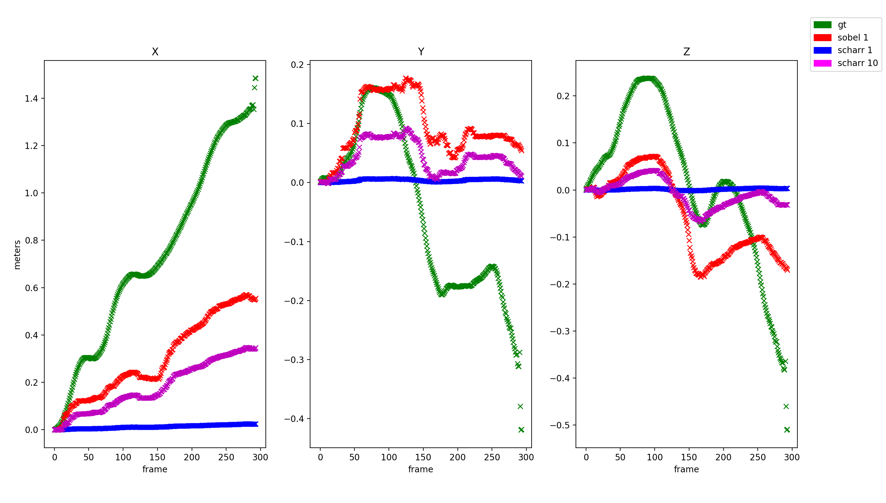
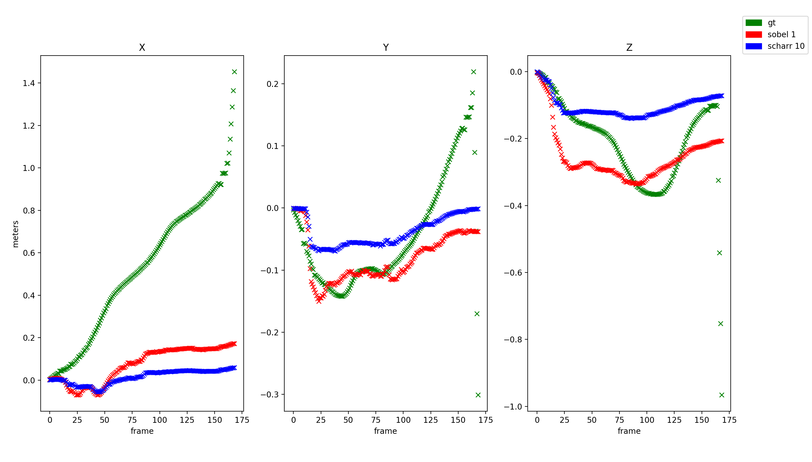

# Dense_VO
Implementation of Dense VO from Robust Odometry Estimation for RGB-D Cameras (No Image Pyramid)

Robust Odometry Estimation for RGB-D Cameras

[Reference Implementation](https://github.com/tum-vision/dvo_slam)

[Paper](https://ieeexplore.ieee.org/document/6631104/)

# Results 
## TUM Freiburg 2 Desk 1

